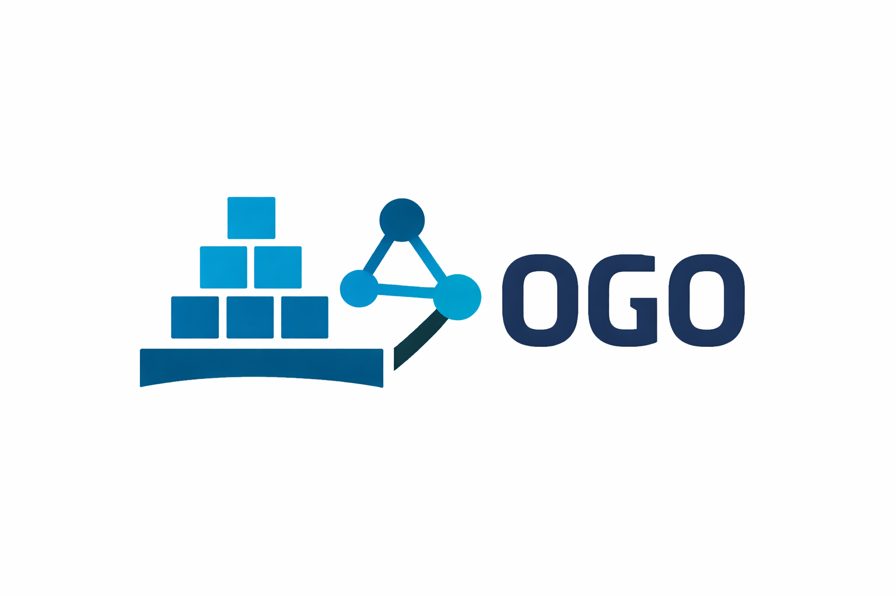

## OGO



Object Graph Programming (OGO) enables manipulating the JVM heap declaratively through queries. The queries are written using the [Cypher Query Language](https://neo4j.com/developer/cypher/).

OGO supports two high-level modes, $OGO^{Neo}$ and $OGO^{Mem}$. The former serializes a sub-graph of the entire JVM heap object graph, loads it into a standalone Neo4J database, and executes queries inside it. The latter executes queries in-memory (inside the native agent) using [Antlr](https://www.antlr.org/) to parse the query and visitors to execute it. Currently, $OGO^{Mem}$ is under construction and not all functionalities may work.

## Examples

1. Searching an `ArrayList` for a given element.

```java
ArrayList<Long> lst = new ArrayList<Long>();
lst.add(10L);
lst.add(20L);
lst.add(30L);
query("MATCH ({$1})-[:elementData]->()-[]->({value : 20}) RETURN TRUE");
```

In this example, we use imperative code to instantiate and add elements to an `ArrayList` and then use `Cypher` query through `OGO` to query `lst` to check if it contains element 20.

2. Implementing the `containsKey` method of `java.util.HashMap`.

```java
public boolean containsKeyOgoImpl(HashMap map, object key) {
    queryBool("MATCH ({$1})-[:table]->()-[]->()-[:key]->(n)"
            + "MATCH (m {$2})"
            + "WHERE n.`equals`(m)"
            + "RETURN COUNT(n) <> 0", map, key);
}
```

In this example, the first `MATCH` clause matches a pattern that collects all the objects corresponding to the `key` field of `HashMap`'s inner class `Node` into the variable `n`. The second `MATCH` clause collects the given key object into the variable `m`. The `WHERE` clause filters the elements of `n` based on the output of `java.lang.Object.equals`, evaluating to true for pairwise inputs from `n` and `m`.

This predicate is expected to filter the number of elements of `n` to 1 if the given key is present in the `map`, and to 0 if absent. Finally, we use the `RETURN` clause to return the value of the expression that compares equality of the number of elements of `n` to 0. The query is expected to return true iff the number of elements in `n` is non-zero, which is true only if the given key is contained in `map`.

## Getting Started

### Prerequisites

The project requires the following dependencies:

- **Maven**
- **Java 21**
- **Conan 2.24.0**
- **CMake**
- **Clang Format**

### Installation

#### 1. Install dependencies

Run the installation script to automatically install all required dependencies:

```bash
./tasks.sh install_deps
```

This checks for and installs any missing dependencies on your system.

Alternatively, verify your dependencies are correctly installed:

```bash
./tasks.sh check_deps
```

#### 2. Build the project

Compile the OGO project:

```bash
./tasks.sh compile
```

#### 3. Full installation

To compile and install the complete project:

```bash
./tasks.sh install
```

### Running the Project

#### Run tests

Execute the test suite:

```bash
./tasks.sh tests
```

#### Run the application

Test out the OGO application by running it against `Main.java`:

```bash
./tasks.sh exec
```

#### Format code

Auto-format Java and C++ code according to project standards:

```bash
./tasks.sh format
```

#### End-to-end setup

Perform a complete setup with dependency checks and full installation:

```bash
./tasks.sh end_to_end
```

## Using OGO in a Maven Project

After packaging, OGO can be used in any Maven project.

### 1. Include client dependency

The client jar can be added as a dependency to a third-party project by adding the following to its pom:

```xml
<dependency>
  <groupId>org.ogo</groupId>
  <artifactId>ogo</artifactId>
  <version>0.1.0</version>
  <scope>system</scope>
  <systemPath><!-- ENTER full path to client jar including jar name --></systemPath>
</dependency>
```

### 2. Include native agent

The native agent can be included during execution by adding the following to the third-party pom:

```xml
<configuration>
  <!-- for adding native agent ogoAgent -->
  <argLine>-agentpath:<!-- ENTER full path to native agent including native agent name --></argLine>
</configuration>
```

Some third-party projects use other plugins that may overwrite `argLine`. It may be necessary to explicitly specify this argument while running tests with Maven:

```bash
mvn test -DargLine="-agentpath:<ENTER full path to native agent including native agent name>"
```

## Metals Inline Cypher Diagnostics (Java)

1. Generate Maven metadata and generated sources:

```bash
mvn -DskipTests clean test-compile
```

2. In VS Code command palette, run:

- Metals: Import Build
- Metals: Restart Build Server
- Metals: Cascade Compile

3. Verify compiler processor wiring in `pom.xml`:

- `maven-compiler-plugin` has `<proc>full</proc>`
- annotation processor is `org.ogo.client.processor.OgoCypherQueryProcessor`

4. Verify Bloop target options include processor flags in both files:

- `.bloop/ogo.json`
- `.bloop/ogo-test.json`

Under `project.java.options`, confirm:

- `-proc:full`
- `-processor`
- `org.ogo.client.processor.OgoCypherQueryProcessor`

5. Verify grammar location for generated parser classes:

- `src/main/resources/Cypher.g4`

ANTLR generation should be configured from that location in `pom.xml`.

6. Quick sanity check:

- Open a Java file under `src/test/java`
- Put an intentionally invalid Cypher query in an `OGO.query*` call
- Save the file and run Metals: Cascade Compile
- Confirm error appears in Problems panel

## Citation

If you use OGO in your research, please cite the following paper:

```bibtex
@inproceedings{ThimmaiahETAL24OGO,
  author    = {Thimmaiah, Aditya and Lampropoulos, Leonidas and Rossbach, Christopher and Gligoric, Milos},
  title     = {Object Graph Programming},
  year      = {2024},
  doi       = {10.1145/3597503.3623319},
  booktitle = {International Conference on Software Engineering},
  pages     = {1--13},
}
```

The paper can be found [here](https://users.ece.utexas.edu/~gligoric/papers/ThimmaiahETAL24OGO.pdf).
